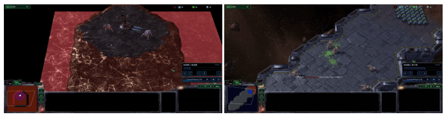

# Stochastic Markov Games for Multi-Agent Reinforcement Learning

<p align="center"></p>  

The project consists of the application of 4 Multi-Agent Reinforcement Learning algorithms in StarCraft II. 

## Installation

The implementation makes use of [PyMARL](https://github.com/oxwhirl/pymarl) (writtent in PyTorch) and is built on top of the QMIX implementation.  

#### 1. Docker Support  

[Skip this step if using a local machine]  

Build the Dockerfile using

```
cd docker
bash build.sh
```

#### 2. StarCraft II and SMAC  

The following command will download SC2 in the '3rdparty' folder and copy the custom SMAC maps required for experiments-
```
bash install_sc2.sh
```

#### 3. Library Dependencies  

Library dependencies are listed in the `requirements.txt` file and can be installed using the following command-  

```
pip install -r requirements.txt
```


## Executing Experiments  

#### 1. Local Machine  

Once the installation is complete, QMIX experiments can be executed using the following command:
```
python3 prog/main.py --config=qmix --env-config=sc2 with env_args.map_name=2s3z
```
The config files consist of default hyperparameter values. To change these for QMIX refer to `qmix.yaml` config file located in `prog/config` folder.  

#### 2. Docker Container  

To run experiments using the Docker container use the following-  
```
bash run.sh $GPU python3 prog/main.py --config=qmix --env-config=sc2 with env_args.map_name=2s3z
```
All results will be stored in the Results folder. For additional details on loading and saving models please refer to the [PyMARL](https://github.com/oxwhirl/pymarl) page.  


## License

Code licensed under the Apache License v2.0
